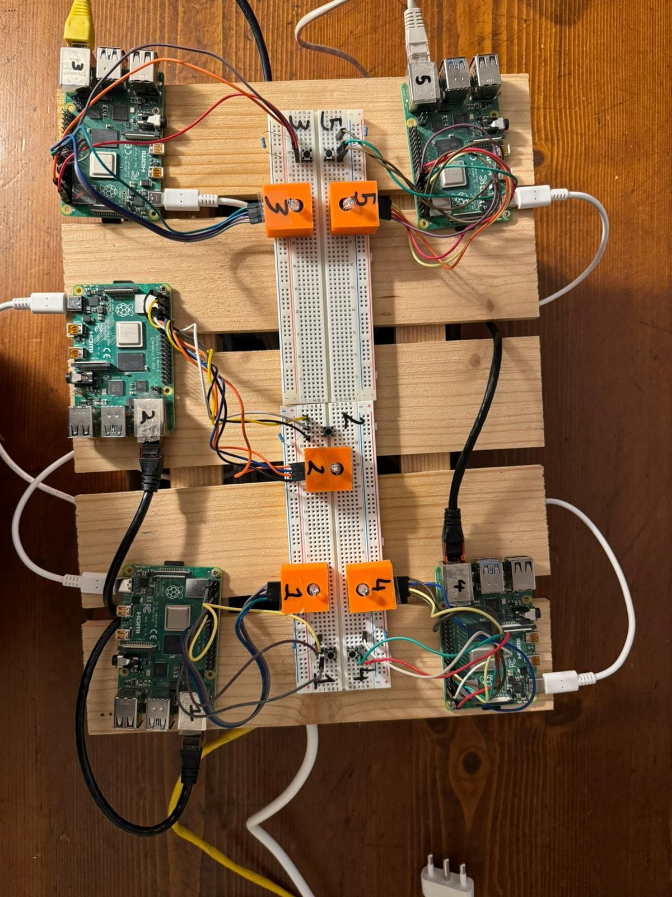
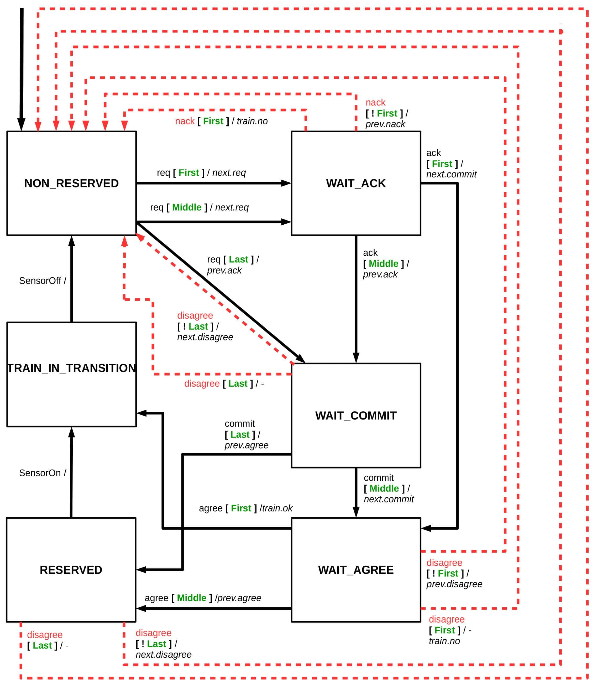
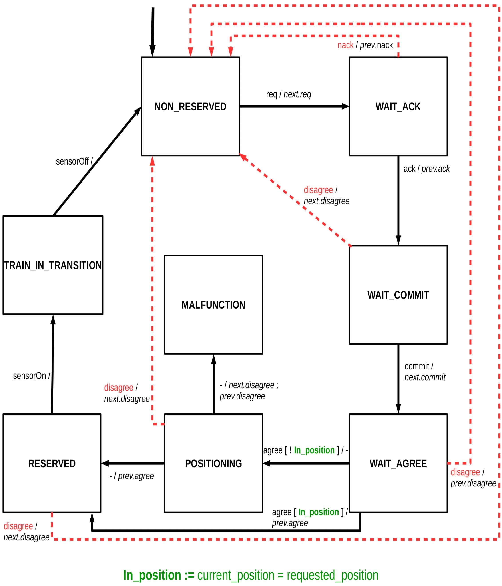
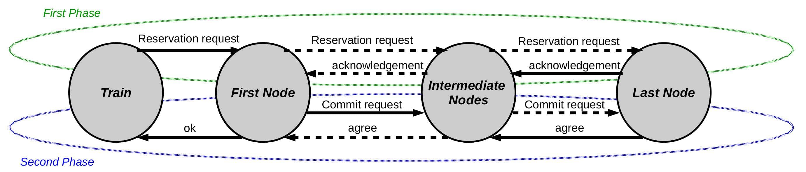

# distributed-railway-interlocking-system
## Introduction
In the field of railway signaling, an interlocking is the signaling apparatus that prevents conflicting train movements in order to ensure traffic safety. Typically such a system is centralized and controls signals and switches in accordance with safety rules codified in current regulations.

Instead, in this project, a distributed system was considered, in which railroad track elements such as tracks and switches have computational capabilities that they use not only to control sensors and actuators, but also for safety and rail traffic management functions. In this way, this distributed network is able to perform the interlocking function without the aid of any centralized computational elements (except for overall operation monitoring).

The goal of this project was to write the code to create a working prototype of a distributed interlocking system and create a representation of the system through the formalism of a Petri net.

*Prototype of the distributed railway interlocking system*

The project in its entirety consists of approximately 3900-4000 lines of code divided into approximately 35 files using C, Python and Bash languages.
    
## System architecture
Each track or switch within the rail network is referred to as a node. In order to reserve passage for a particular route, a train (referred to as a "host") communicates with the nodes on that route and thanks to the two-phase commit protocol receives an acknowledgement or rejection on passage.

Each node is equipped with a Raspberry Pi 4B and VxWorks 7 real-time operating system to perform the required computations. Specifically, each node runs a multitasking application to ensure proper operation and security of the rail system. Communication between tasks is possible through message queues and traffic lights. Each node is also equipped with a sensor to check whether a train is currently occupying the line section and an LED to indicate the node's operating status. To enable automatic testing, a special message was also developed to simulate the passage of a train without having to press the button. In addition, if the node is a switch node, the positioning of the switch between two possible positions is also simulated.

## Two-phase commit protocol.
The node control logic implements a two-phase commit protocol mechanism to enable route reservation. This protocol can be schematized as the following state machine:

|                                                              |                                  |
| ------------------------------------------------------------ | -------------------------------- |
|    | State machine track circuit      |
|  | State machine railroad switch    |

**Legend state machines:**
- req : incoming route request message
- ack, agree, disagree, commit : two phase commit protocol messages
- next.XX : sending message XX to the next element of the itinerary
- prev.YY : send message YY to the previous element of the itinerary
- Each message consists of two parts (e.g. req/next.req), the first part indicates the message that was received by the node (req in the example), the second part the message that the node sends (next.req in the example)

The following is a diagram of the two phases that make up the two-phase commit protocol:

*Two phase commit protocol*

## Taskset
Il taskset eseguito da ogni nodo è composto da 6 task fondamentali:
-	initTask, ha lo scopo di ricevere all’accensioni informazioni sulla posizione del nodo all’interno della rete ferroviaria (che percorsi passano per tale nodo, quali sono i nodi predecessori e successori, etc…) e di aprire una comunicazione con tutti i nodi adiacenti nella rete.
-	controlTask, ha lo scopo di monitorare i sensori del nodo, gestire lo stato di avanzamento del two-phase commit e modificare conseguentemente lo stato del nodo, processare i messaggi ricevuti dal task di comunicazione e controllare lo stato di avanzamento del task di diagnostica. Questo task interagisce principalmente con il task di comunicazione e quello di diagnostica.
-	communicationTask (denominato anche wifiTask), ha lo scopo di scambiare messaggi con altri nodi della rete, verifica se sono stati inviati o ricevuti messaggi di diagnostica e inviare all’host informazioni sullo stato del nodo e i log generati dal nodo. Questo task interagisce principalmente con il task di controllo e quello di diagnostica.
-	positioningTask, ha lo scopo di simulare l'azionamento del deviatoio quando necessario per completare la preparazione al passaggio di un treno. In particolare, questo task viene spawnato all'occorrenza dal task di controllo e procede a modificare la posizione del deviatoio. Per simulare il comportamento fisico del deviatoio si ha che il task può segnalare un malfunzionamento del motore che muove lo scambio. 
-	diagnosticsTask, ha lo scopo di verificare che tutti i nodi con cui è stata stabilita una connessione siano attivi e in grado di rispondere. Per fare questo richiede al task di comunicazione di inviare ai vicini messaggi di ping e attendere, entro un timeout, tutte le risposte.  In caso tutte le risposte non siano pervenute il diagTask lo comunica al controlTask che seguirà a far entrare il nodo in uno stato di ping-fail-safe. Questo task interagisce principalmente con il task di controllo e quello di comunicazione.
-	logTask, ha lo scopo di creare uno strumento per poter scrivere i log di esecuzione. Il task crea una coda in cui altri task possono aggiungere dei messaggi da salvare e procede a controllare periodicamente questa coda e a scrivere tali messaggi su un file di testo. 
Sono presenti ulteriori task essenziali per il corretto funzionamento del nodo:
-	destructorTask, ha lo scopo di permettere un’interruzione sicura dei task in esecuzione e il rilascio delle risorse allocate. Il meccanismo utilizzato per implementare questo task è quello dell’uso dei signal.
-	timerTask, ha lo scopo di interagire con i registri del timer presente nella CPU BCM2711 del Raspberry Pi 4B per fornire un’informazione accurata sui tempi di esecuzione dei task. Il timer ha una frequenza di lavoro di 54 MHz e dispone di 32 bit di registro, quindi riesce a contare fino a circa 79.536 secondi prima di resettarsi e ripartire a contare da zero. Lo scopo di questo task, quindi, è quello di monitorare questi overflow e mantenere memoria di quante volte sono avvenuti dall’avvio del task.
-	sendLogTask, ha lo scopo di fare una copia dei file di log ed inviarli all’host.
