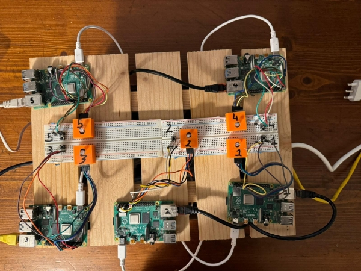
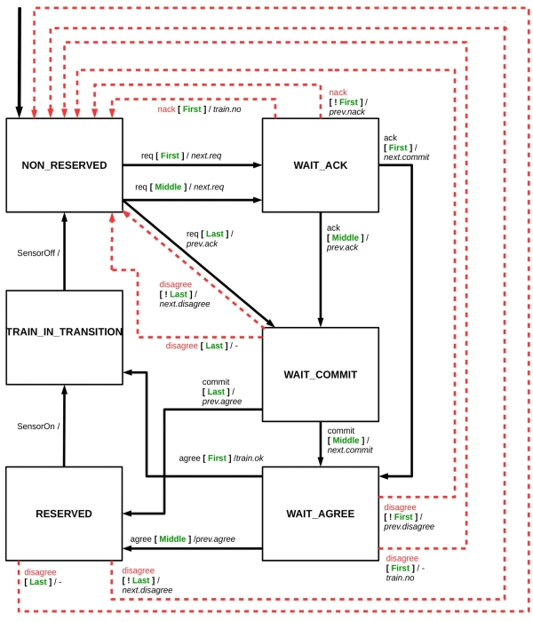
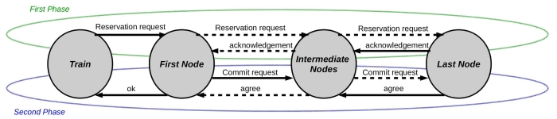
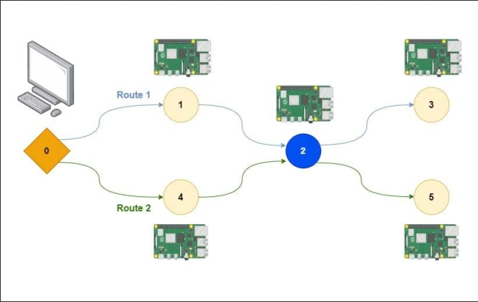
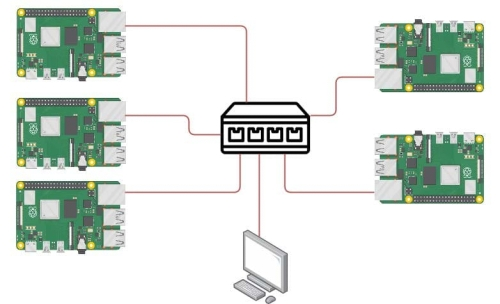
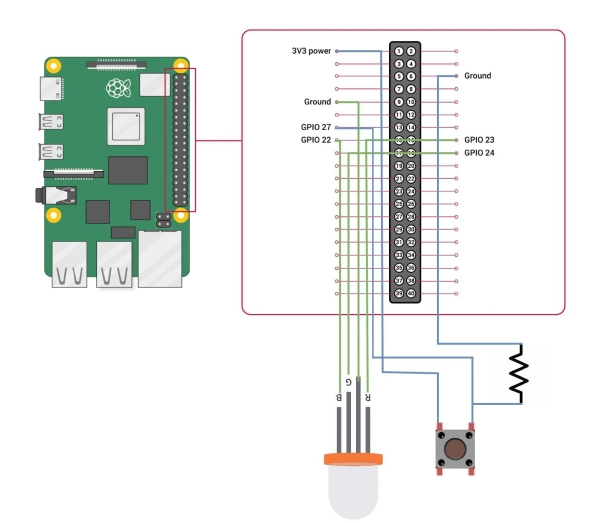
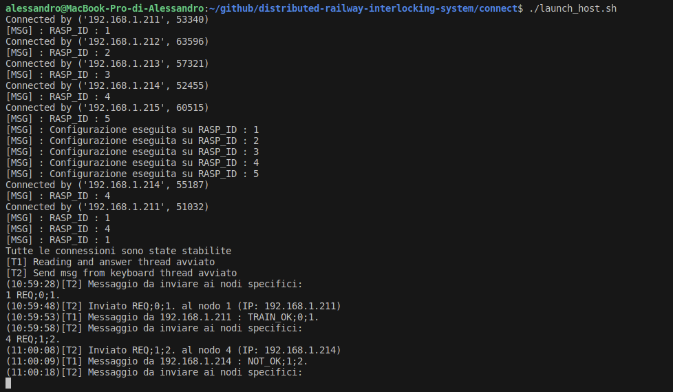

# distributed-railway-interlocking-system

<details>
  <summary>Table of Contents</summary>
  <ol>
    <li><a href="#About">About</a></li>
    <li><a href="#System architecture">System architecture</a></li>
    <li><a href="#Two-phase commit protocol">Two-phase commit protocol</a></li>
    <li><a href="#Taskset">Taskset</a></li>
    <li><a href="#Test configuration">Test configuration</a></li>
    <li><a href="#Modeling with Petri Net">Modeling with Petri Net</a></li>
    <li><a href="#Deadline">Deadline</a></li>
    <li><a href="#Hardware Setup">Hardware Setup</a></li>
    <li><a href="#Getting started">Getting started</a></li>
    <li><a href="#Workbench">Workbench</a></li>
    <li><a href="#Usage example">Usage example</a></li>
    <li><a href="#References">References</a></li>
    <li><a href="#Project Authors">Project Authors</a></li>
    <li><a href="#Developers">Developers</a></li>
  </ol>
</details>

## About
In the field of railway signaling, an interlocking is the signaling apparatus that prevents conflicting train movements in order to ensure traffic safety. Typically such a system is centralized and controls signals and switches in accordance with safety rules codified in current regulations.

Instead, in this project, a distributed system was considered, in which railroad track elements such as tracks and switches have computational capabilities that they use not only to control sensors and actuators, but also for safety and rail traffic management functions. In this way, this distributed network is able to perform the interlocking function without the aid of any centralized computational elements (except for overall operation monitoring).

The goal of this project was to write the ***code to create a working prototype of a distributed interlocking system*** and ***create a representation of the system through the formalism of a Petri net***.



*Prototype of the distributed railway interlocking system*

The project in its entirety consists of approximately **3900-4000 lines of code** divided into approximately **35 files** using **C, Python and Bash languages**.
    
## System architecture
Each track or switch within the rail network is referred to as a node. In order to reserve passage for a particular route, a train (referred to as a "host") communicates with the nodes on that route and thanks to the two-phase commit protocol receives an acknowledgement or rejection on passage.

Each node is equipped with a Raspberry Pi 4B and VxWorks 7 real-time operating system to perform the required computations. Specifically, each node runs a multitasking application to ensure proper operation and security of the rail system. Communication between tasks is possible through message queues and traffic lights. Each node is also equipped with a sensor to check whether a train is currently occupying the line section and an LED to indicate the node's operating status. To enable automatic testing, a special message was also developed to simulate the passage of a train without having to press the button. In addition, if the node is a switch node, the positioning of the switch between two possible positions is also simulated.

## Two-phase commit protocol
The node control logic implements a two-phase commit protocol mechanism to enable route reservation. This protocol can be schematized as the following state machine:

|                                                              |                                  |
| ------------------------------------------------------------ | -------------------------------- |
|    | State machine track circuit      |
|  | State machine railroad switch    |

**Legend state machines:**
- req : incoming route request message
- ack, agree, disagree, commit : two phase commit protocol messages
- next.XX : sending message XX to the next element of the itinerary
- prev.YY : send message YY to the previous element of the itinerary
- Each message consists of two parts (e.g. req/next.req), the first part indicates the message that was received by the node (req in the example), the second part the message that the node sends (next.req in the example)

----------------

The following is a diagram of the two phases that make up the two-phase commit protocol:



*Two phase commit protocol*

The **first phase**, referred to as the "voting phase," begins with the train sending a message stating the route to be reserved. That message is then propagated through the network of nodes, and if all the nodes agree with the request, the last node will send an acknowledgement message to be propagated to the first node. If, however, one of the nodes disagrees with the request, the disagreeing node will send a not acknowledgement message to be propagated toward the train.

The **second phase**, referred to as the "completion phase," begins when the first node in the communication chain receives a message confirming termination of the first phase. At this point, the first node will send a commit request to be propagated to the last node. The commit message will cause railroad switches on the route to be placed on the requested route and track circuits to be reserved. If a node does not meet the conditions to commit, it will send a disagreement message that will be propagated to all nodes involved in the transaction. Upon receiving a disagreement message: nodes that have already executed the transaction will try to return to the previous state, while nodes that have yet to commit will abandon the pending transaction. A disagreement event will simply cause nodes to abandon the pending reservation, reverting to an unreserved state indicating availability for new requests. When the last node in the system receives the commit message, it will send an agree message to be propagated back through the nodes. When the first node, immediately following the train, receives the agree message, it will send an OK message to the train.

## Taskset
The taskset executed by each node consists of 6 basic tasks:
- **initTask**, has the purpose of receiving at power-up information about the node's location within the rail network (what paths pass through that node, what are the predecessor and successor nodes, etc...) and to open a communication with all adjacent nodes in the network.
- **controlTask**, aims to monitor the node's sensors, manage the progress of the two-phase commit and modify the node's status accordingly, process messages received from the communication task, and check the progress of the diagnostic task. This task mainly interacts with the communication task and the diagnostic task.
- **communicationTask** (also referred to as wifiTask), aims to exchange messages with other nodes in the network, check whether diagnostic messages have been sent or received, and send node status information and logs generated by the node to the host. This task mainly interacts with the control task and the diagnostic task.
- **positioningTask**, is intended to simulate the operation of the switch when necessary to complete the preparation for the passage of a train. Specifically, this task is spawned as needed by the control task and proceeds to change the position of the switch. To simulate the physical behavior of the switch, one has that the task can signal a malfunction of the motor that moves the switch.
- **diagnosticsTask**, aims to verify that all nodes with which a connection has been established are active and able to respond. To do this it requires the communication task to send ping messages to neighbors and wait, within a timeout, for all responses.  If all responses have not been received, the diagTask notifies the controlTask, which will follow to put the node into a ping-fail-safe state. This task interacts mainly with the control task and the communication task.
- **logTask**, is intended to create a tool to be able to write execution logs. The task creates a queue in which other tasks can add messages to be saved and proceeds to periodically check this queue and write these messages to a text file.

There are additional tasks that are essential to the proper functioning of the node:
- **destructorTask**, is intended to allow safe termination of running tasks and release of allocated resources. The mechanism used to implement this task is the use of signals.
- **timerTask**, is intended to interact with the timer registers in the Raspberry Pi 4B's BCM2711 CPU to provide accurate information about task execution times. The timer has a working frequency of 54 MHz and has 32 bits of register, so it can count up to about 79,536 seconds before resetting itself and restarting to count from zero. The purpose of this task, then, is to monitor these overflows and maintain memory of how many times they have occurred since the task was started.
- **sendLogTask**, is intended to make a copy of the log files and send them to the host.

## Test configuration
The test prototype uses the configuration shown in the figure. Specifically, there are 5 nodes divided into two routes each of which has its own initial (nodes 1 and 4) and final (nodes 3 and 5) track circuits and shares a same switch node (node 2) with the other route. Both routes are in the same direction, which leads to the fact that if the train (node 0) sends a request for one of the two routes it will result in the other being unavailable until the train has completed its passage.



*Configuration setup*

This was verified:
- A route request is successful, for both routes, in case neither track circuit nor railway switch is occupied.
- The request of an itinerary fails, for both itineraries, in case the track circuit or the switch, or both, are occupied.
- Sequential occupancy of the elements of a requested itinerary, followed by sequential release of the same elements, makes the itinerary available again.
- Requesting a second route while a first route is requested or reserved fails.
- Simulating a failure in the movement of the exchange locks the system (fail-safe state). This state is identified by the lighting of a red LED, and the system will proceed to reject further reservations of routes that include that specific switch track.


## Modeling with Petri Net
In addition to implementing the code capable of enabling the operation of the distributed interlocking system another main objective of this project was to create a model of the system using a Petri net. Petri nets, in fact, allow for very efficient modeling of systems in which there are choices and concurrent executions. In our design, the Petri net must provide an accurate and detailed representation of a distributed rail interlocking system, including both the physical components, such as trains, tracks and switches, and the communication components that play a crucial role in orchestrating operations. Given the need to model a physical system in which time plays a key role, it was decided to opt for an extension of the Petri net called the Timed Petri Net. Since in the VxWorks real-time operating system the scheduler allocates resources with a priority mechanism, providing the possibility of preemption between tasks, this possibility was also added in the model, through the use of Preemptive Timed Petri Net. The Oris Tool 1.0 developed by the Università degli Studi di Firenze was used to create and analyze this network.

This tool made it possible to:
- Enumerate the states reachable by the system,
- Verify the correctness in order and execution time of each sub-part of a task (called transition) by going to analyze the execution logs of each node,
- Verify compliance with the deadlines set for the execution of each task by analyzing the execution logs

The Petri net is shown below, with the different tasks and shared memory zones highlighted in different colors:


## Deadline
An essential point in the development of the model was to go out and identify and quantify any time constraints that must be met to ensure that interlocking works properly. Some of these deadlines are for example:
- The time taken to place the turnout,
- The time it takes to book a route,
- The time between booking a route and the actual passage of the train,
- The time it takes to travel the entire node,
- The time between two successive reservations of the same node.

## Hardware Setup
The system consists of 5 nodes connected to the same local area network. The train requesting a route reservation is simulated by a PC connected to the same local network. The configuration is shown in the figure:



*Hardware Setup*

Each node is equipped with an LED that shows the status and a button that, when pressed, indicates the presence of the train at that node:



*Button and LED*

## Getting started
- The system was developed using Ubuntu 22.04
- Raspberry Pi 4Bs running VxWorks 7 were used. This was accomplished by following the instructions on [Windriver's official website](https://labs.windriver.com/downloads/wrsdk-vxworks7-docs/README-raspberrypi4b.html)
- Workbench 4 installation of VxWorks 7 is required
- You proceed to clone this [github repo](https://github.com/albe9/distributed-railway-interlocking-system)
- You need to download and extract the SDK for Raspberry Pi 4B from the [official VxWorks site](https://forums.windriver.com/t/vxworks-software-development-kit-sdk/43). The extraction must be done in the parent directory of the project (i.e. *parent_folder/distributed-railway-interlocking-system*). The SDK version 1.4 was used during development
- Within the *connect* folder you must rename the *build_example.config* file to *build.config* and add the WindRiver installation path and the IP address of the host (PC simulating the train from which to send commands) as shown in the code below:
    ```
    [WindRiver_path] : "/PATH/TO/INSTALLATION/WindRiver",
    [Host_ip] : "192.168.1.203"
    ```
  
- You proceed to unzip the *rpivsb.rar* file so that the extracted contents are inside the git root (i.e. inside *distributed-railway-interlocking-system*)
- We proceed to unzip the *vxWorks.zip* file so that the extracted contents are inside the *connect* folder
- In the *connect/target.txt* file, an IP address is given on each line where there is a different node used, e.g. on the first line *192.168.1.211*, on the second line *192.168.1.212*, etc...
- The total number of nodes present is an argument to pass when running the python script *host_script/host.py*. To change the number permanently, you may want to edit the *connect/launch_host.sh* file (where the default is 5 nodes) and additional files, such as *connect/workbench.sh*

## Workbench
Given the nature of the project in which there are multiple nodes (called targets) it was rather laborious to use the WorkBench 4 GUI to perform specific actions. For example, through the GUI it is possible to connect and load modules on a single target at a time. For this reason, we decided to create the *./workbench.sh* script (found in the *connect|* directory) that allowed us to interact with nodes in a more efficient and more scalable way. This script uses within it:
- Wrtool, the command-line utility developed by WindRiver for creating, compiling and managing Vxworks projects.
- WRDBG, the debug shell provided by Wind River that allows you to connect to targets and load and unload modules within the kernel.
- Named pipes from Ubuntu and regex to parse the input and output of the various shells in the background.

The functionality implemented in *./workbench.sh* can be used by running the command-line script with the following arguments:

| Option          | Description                                                                      |                
| --------------- | -------------------------------------------------------------------------------- |
| -b (build)      | Runs the project build                                                           |
| -c (connect)    | Connects to nodes and opens telnet shells to execute commands remotely           |
| -l (load)       | Performs module load on the nodes                                                |                
| -o (output)     | Receives logs from the nodes                                                     |
| -d (delete)     | Performs task delete of the modules loaded on the nodes                          |
| -r (reboot)     | Performs reboot of the nodes                                                     |
| -t (testing)    | Performs a number of automatic reservation testing (no need to click the button) |
| -h (help)       | Show this help message                                                           |

Note: These commands can be called in succession, e.g. to compile, connect, and load forms you can run *./workbench -bcl*

## Usage example
Once a terminal is started and placed in *connect* run *./workbench -bcl* to compile, connect to targets and load modules.  Open two terminals and run from terminal A *launch_host.sh* and from terminal B *launch_nodes.sh* to start the configuration and connection phase. From terminal A to ask node 1 to start the procedure to reserve route 2 on behalf of train 0 type the command *1 REQ;0;2.* and press enter.



*Node initialization and requests for two different routes*

## References
Fantechi Alessandro. *“Distributing the challenge of model checking interlocking control tables”*. 
In: *Leveraging Applications of Formal Methods, Verification and Validation. Applications and Case Studies - 5th International Symposium, pp. 276–289, Heraclion, Crete, 15-18 October 2012*. Springer, Berlin, DEU, 2012.

DOI: [10.1007/978-3-642-34032-1_26](https://doi.org/10.1007/978-3-642-34032-1_26)

-----------

Giacomo Bucci, Laura Carnevali, Lorenzo Ridi, and Enrico Vicario. *“Oris: A tool for modeling, verification and evaluation of real-time systems”*. In: *STTT  12 (Sept. 2010), pp. 391–403.*

DOI: [10.1007/s10009-010-0156-8](https://doi.org/10.1007/s10009-010-0156-8)

-----------

Alessandro Fantechi, Anne Haxthausen, and Michel Nielsen. *“Model Checking Geographically Distributed Interlocking Systems Using UMC”*. In: *Jan. 2017, pp. 278–286.*

DOI: [10.1109/PDP.2017.66](https://doi.org/10.1109/PDP.2017.66).


# Project Authors

This project was carried out for the course "Software Engineering for Embedded Systems" in the Advanced Computing curriculum of the Master of Science degree in Computer Engineering at the Università degli Studi di Firenze. 
The project assignment and outline of system requirements were directed by: 
* Laura Carnevali - Associate Professor - Università degli Studi di Firenze
* Alessandro Fantechi - Full Professor - Università degli Studi di Firenze
* Imad Zaza - Ph.D - Università degli Studi di Firenze


## Project technical leads

* Damerini Jacopo - Student - Florence (Italy)
* Filino Alessandro - Student - Florence (Italy)
* Macaluso Alberto​ - Student - Florence (Italy)


## Developers

* Damerini Jacopo - Student - Florence (Italy)
* Filino Alessandro - Student - Florence (Italy)
* Macaluso Alberto​ - Student - Florence (Italy)


