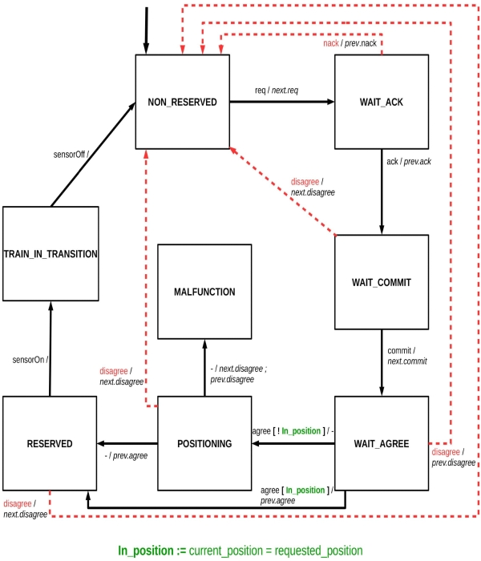

# distributed-railway-interlocking-system
## Introduction
In the field of railway signaling, an interlocking is the signaling apparatus that prevents conflicting train movements in order to ensure traffic safety. Typically such a system is centralized and controls signals and switches in accordance with safety rules codified in current regulations.

Instead, in this project, a distributed system was considered, in which railroad track elements such as tracks and switches have computational capabilities that they use not only to control sensors and actuators, but also for safety and rail traffic management functions. In this way, this distributed network is able to perform the interlocking function without the aid of any centralized computational elements (except for overall operation monitoring).

The goal of this project was to write the code to create a working prototype of a distributed interlocking system and create a representation of the system through the formalism of a Petri net.

*Prototype of the distributed railway interlocking system*

The project in its entirety consists of approximately 3900-4000 lines of code divided into approximately 35 files using C, Python and Bash languages.
    
## System architecture
Each track or switch within the rail network is referred to as a node. In order to reserve passage for a particular route, a train (referred to as a "host") communicates with the nodes on that route and thanks to the two-phase commit protocol receives an acknowledgement or rejection on passage.

Each node is equipped with a Raspberry Pi 4B and VxWorks 7 real-time operating system to perform the required computations. Specifically, each node runs a multitasking application to ensure proper operation and security of the rail system. Communication between tasks is possible through message queues and traffic lights. Each node is also equipped with a sensor to check whether a train is currently occupying the line section and an LED to indicate the node's operating status. To enable automatic testing, a special message was also developed to simulate the passage of a train without having to press the button. In addition, if the node is a switch node, the positioning of the switch between two possible positions is also simulated.

## Two-phase commit protocol.
The node control logic implements a two-phase commit protocol mechanism to enable route reservation. This protocol can be schematized as the following state machine:

|                                                              |                                  |
| ------------------------------------------------------------ | -------------------------------- |
|    | State machine track circuit      |
|  | State machine railroad switch    |

**Legend state machines:**
- req : incoming route request message
- ack, agree, disagree, commit : two phase commit protocol messages
- next.XX : sending message XX to the next element of the itinerary
- prev.YY : send message YY to the previous element of the itinerary
- Each message consists of two parts (e.g. req/next.req), the first part indicates the message that was received by the node (req in the example), the second part the message that the node sends (next.req in the example)

The following is a diagram of the two phases that make up the two-phase commit protocol:

*Two phase commit protocol*

## Taskset
The taskset executed by each node consists of 6 basic tasks:
- **initTask**, has the purpose of receiving at power-up information about the node's location within the rail network (what paths pass through that node, what are the predecessor and successor nodes, etc...) and to open a communication with all adjacent nodes in the network.
- **controlTask**, aims to monitor the node's sensors, manage the progress of the two-phase commit and modify the node's status accordingly, process messages received from the communication task, and check the progress of the diagnostic task. This task mainly interacts with the communication task and the diagnostic task.
- **communicationTask** (also referred to as wifiTask), aims to exchange messages with other nodes in the network, check whether diagnostic messages have been sent or received, and send node status information and logs generated by the node to the host. This task mainly interacts with the control task and the diagnostic task.
- **positioningTask**, is intended to simulate the operation of the switch when necessary to complete the preparation for the passage of a train. Specifically, this task is spawned as needed by the control task and proceeds to change the position of the switch. To simulate the physical behavior of the switch, one has that the task can signal a malfunction of the motor that moves the switch.
- **diagnosticsTask**, aims to verify that all nodes with which a connection has been established are active and able to respond. To do this it requires the communication task to send ping messages to neighbors and wait, within a timeout, for all responses.  If all responses have not been received, the diagTask notifies the controlTask, which will follow to put the node into a ping-fail-safe state. This task interacts mainly with the control task and the communication task.
- **logTask**, is intended to create a tool to be able to write execution logs. The task creates a queue in which other tasks can add messages to be saved and proceeds to periodically check this queue and write these messages to a text file.

There are additional tasks that are essential to the proper functioning of the node:
- **destructorTask**, is intended to allow safe termination of running tasks and release of allocated resources. The mechanism used to implement this task is the use of signals.
- **timerTask**, is intended to interact with the timer registers in the Raspberry Pi 4B's BCM2711 CPU to provide accurate information about task execution times. The timer has a working frequency of 54 MHz and has 32 bits of register, so it can count up to about 79,536 seconds before resetting itself and restarting to count from zero. The purpose of this task, then, is to monitor these overflows and maintain memory of how many times they have occurred since the task was started.
- **sendLogTask**, is intended to make a copy of the log files and send them to the host.
